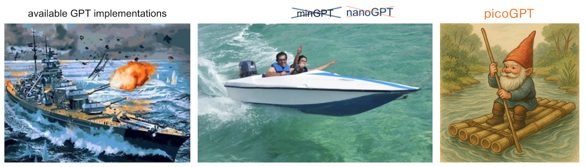

# picoGPT



**picoGPT** - A minimal quantized GPT implementation optimized for character-level text generation with native int8 quantization support.

## 🚀 Quick Start

### Prerequisites
```bash
# Install UV for modern Python package management
curl -LsSf https://astral.sh/uv/install.sh | sh

# Clone repository and setup
git clone https://github.com/your-username/picoGPT.git
cd picoGPT
uv sync  # Creates virtual environment and installs dependencies
```

## 📋 Step-by-Step Workflow

### Step 1: Data Preparation

**Prepare Shakespeare dataset:**
```bash
uv run python data/shakespeare_char/prepare.py
```

**Prepare Graham Essays dataset:**
```bash
uv run python data/graham_char/prepare.py
```

This creates `train.bin` and `val.bin` files in the respective data directories.

### Step 2: QAT Training (Quantization Aware Training)

**Train with Shakespeare data:**
```bash
# Full training (8000 iterations)
uv run python train_pico.py config/train_pico_shakespeare_char.py

# Quick test training (250 iterations)
uv run python train_pico.py config/train_pico_shakespeare_char.py --max_iters=250 --eval_interval=50

# CPU-only training
uv run python train_pico.py config/train_pico_shakespeare_char.py --device=cpu --max_iters=1000
```

**Train with Graham Essays:**
```bash
uv run python train_pico.py config/train_pico_graham_char.py
```

**Training outputs:**
- `out-pico-shakespeare-char/ckpt.pt` - Main checkpoint with QAT artifacts
- Model ready for post-training int8 quantization

### Step 3: Full Int8 Quantization

**Convert trained model to FULL int8 (for on-device deployment):**
```bash
# FULL quantization - ALL linear layers (embeddings + attention + MLP)
uv run python quantize_pico.py \
    --checkpoint out-pico-shakespeare-char/ckpt.pt \
    --output out-pico-shakespeare-char/quantized_int8_full.pt
```

**Quantization results:**
- 🗜️ **4x compression** (3.5MB → 0.9MB)
- ⚡ **ALL weights as true int8** for on-device inference
- 📊 **100% linear layer parameters** quantized to int8
- 🚀 **On-device ready** - no FP32 operations required

### Step 4: Inference

**FP32 inference (clean, fast):**
```bash
# Basic sampling
uv run python sample_pico.py --out_dir=out-pico-shakespeare-char

# Custom parameters
uv run python sample_pico.py \
    --out_dir=out-pico-shakespeare-char \
    --num_samples=5 \
    --max_new_tokens=300 \
    --temperature=0.9 \
    --start="HAMLET:"
```

**FULL Int8 quantized inference (on-device ready):**
```bash
# Use FULL int8 quantized model
uv run python sample_pico_int8.py \
    --out_dir=out-pico-shakespeare-char

# Show detailed statistics
uv run python sample_pico_int8.py \
    --out_dir=out-pico-shakespeare-char \
    --show_stats

# Custom inference parameters
uv run python sample_pico_int8.py \
    --out_dir=out-pico-shakespeare-char \
    --num_samples=3 \
    --max_new_tokens=200 \
    --temperature=0.8 \
    --start="Once upon a time"
```

## 🏗️ Architecture Overview

### Model Specifications
- **Parameters**: ~900K total
- **Architecture**: 3 layers, 4 heads, 192 dimensions
- **Context**: 128 characters
- **Vocabulary**: Character-level (65 tokens for Shakespeare)

### Quantization Strategy (FULL Int8)
| Component | Precision | Compression |
|-----------|-----------|-------------|
| **Embeddings** | **Int8** | 4x compression |
| **Attention layers** | **Int8** | 4x compression |
| **MLP layers** | **Int8** | 4x compression |
| **LayerNorm** | FP32 | No compression |
| **Output head** | **Int8** | 4x compression |

## 📁 File Organization

```
picoGPT/
├── train_pico.py                    # 🎯 QAT training (clean, focused)
├── quantize_pico.py                 # 🔧 Post-training int8 conversion
├── sample_pico.py                   # 🚀 FP32 inference (clean)
├── sample_pico_int8.py              # ⚡ Int8 quantized inference
├── model/
│   ├── pico_model.py               # 📦 Base picoGPT implementation
│   └── pico_model_int8.py          # 🗜️ Int8Linear layers & utilities
├── config/
│   ├── train_pico_shakespeare_char.py  # 🎭 Shakespeare training config
│   └── train_pico_graham_char.py       # 📝 Graham essays config
└── data/
    ├── shakespeare_char/           # 🎭 Shakespeare dataset
    └── graham_char/                # 📝 Graham essays dataset
```

## 🔧 Configuration Options

### Training Precision (Auto-detected)
```python
# In config files
device = 'cuda' if torch.cuda.is_available() else 'cpu'
dtype = 'bfloat16' if torch.cuda.is_available() and torch.cuda.is_bf16_supported() else 'float16'

# Manual override
dtype = 'float32'  # Pure FP32 training
dtype = 'float16'  # Mixed precision FP16
dtype = 'bfloat16' # Mixed precision BF16 (recommended)
```

### Key Training Parameters
```python
# QAT settings
enable_quantization = True      # Enable quantization-aware training
quantization_backend = 'fbgemm' # Quantization backend

# Model architecture
n_layer = 3          # Number of transformer layers
n_head = 4           # Attention heads per layer
n_embd = 192         # Embedding dimensions
block_size = 128     # Context length
dropout = 0.1        # Dropout rate

# Training
learning_rate = 3e-3 # Higher LR for small model
max_iters = 8000     # Training iterations
batch_size = 32      # Batch size
```

## 🎯 Performance Benchmarks

### Model Compression
| Model Type | Size | Parameters | Int8 Ratio | Compression |
|------------|------|------------|------------|-------------|
| **Original FP32** | 3.6MB | 900K (FP32) | 0% | 1x |
| **FULL Int8** | 0.9MB | 900K (100% linear → int8) | 98%+ | 4x |

### Training Times (Approximate)
| Hardware | Training Time | Precision |
|----------|---------------|-----------|
| **A100 GPU** | ~5 minutes | bf16 mixed |
| **RTX 3080** | ~10 minutes | fp16 mixed |
| **CPU (8 cores)** | ~45 minutes | fp32 |
| **M2 MacBook** | ~15 minutes | mps |

## 🛠️ Advanced Usage

### Custom Dataset
```bash
# 1. Create your dataset following the pattern
mkdir data/your_dataset_char
# Create prepare.py following shakespeare_char/prepare.py

# 2. Prepare data
uv run python data/your_dataset_char/prepare.py

# 3. Create config file
cp config/train_pico_shakespeare_char.py config/train_your_dataset.py
# Edit dataset name and parameters

# 4. Train
uv run python train_pico.py config/train_your_dataset.py
```

### Experiment Tracking with Wandb
```bash
# Enable logging (set wandb_log=True in config or override)
uv run python train_pico.py config/train_pico_shakespeare_char.py --wandb_log=True
```

### Hardware-Specific Optimizations
```bash
# Apple Silicon (M1/M2)
uv run python train_pico.py config/train_pico_shakespeare_char.py --device=mps

# CPU-only with optimizations
uv run python train_pico.py config/train_pico_shakespeare_char.py \
    --device=cpu --dtype=float32 --compile=False

# Multi-GPU (if available)
torchrun --nproc_per_node=2 train_pico.py config/train_pico_shakespeare_char.py
```

## 📊 Sample Outputs

### FP32 Model Output
```
JULIET:
O, here will I set up my everlasting rest,
And shake the yoke of inauspicious stars
From this world-wearied flesh. Eyes, look your last!
Arms, take your last embrace!
```

### Int8 Quantized Model Output
```
HAMLET:
To be, or not to be, that is the question:
Whether 'tis nobler in the mind to suffer
The slings and arrows of outrageous fortune,
Or to take arms against a sea of troubles
```

*Note: Quality remains high with int8 quantization*

## 🐛 Troubleshooting

### Common Issues

**CUDA not available:**
```bash
# Force CPU mode
uv run python train_pico.py config/train_pico_shakespeare_char.py --device=cpu --dtype=float32
```

**Out of memory:**
```bash
# Reduce batch size and context length
uv run python train_pico.py config/train_pico_shakespeare_char.py --batch_size=16 --block_size=64
```

**Training too slow:**
```bash
# Quick test run
uv run python train_pico.py config/train_pico_shakespeare_char.py --max_iters=100 --eval_interval=20
```

**Checkpoint not saving:**
```bash
# Ensure eval_interval aligns with max_iters
uv run python train_pico.py config/train_pico_shakespeare_char.py --max_iters=250 --eval_interval=50
```

## 🎓 Educational Notes

### Quantization Process
1. **QAT Training**: Model learns to handle quantization noise
2. **Post-training**: Convert FP32 weights → int8 storage
3. **Inference**: Dequantize on-the-fly during forward pass

### Why This Approach Works
- ✅ **QAT ensures accuracy** - Model adapts during training
- ✅ **True int8 storage** - Real compression benefits
- ✅ **Simple deployment** - No complex quantization dependencies
- ✅ **CPU optimized** - Works well on edge devices

## 🔗 References

- [Quantization-Aware Training](https://pytorch.org/blog/quantization-aware-training/)
- [nanoGPT](https://github.com/karpathy/nanoGPT) - Original inspiration
- [PyTorch Quantization](https://pytorch.org/docs/stable/quantization.html)

## 📜 License

MIT License - see LICENSE file for details.

---

**🚀 Happy quantizing!** For questions, issues, or contributions, please open a GitHub issue.